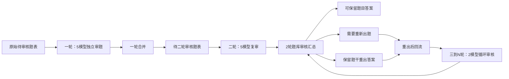

# Error Hunter：AI 面试题批量审题 Skill

`batch-interview-question-audit` 是一个用于 **AI 面试题库质量审核** 的 Cursor Agent Skill。它把题库按轮次交给多个模型独立审题，再用脚本完成结果合并、错误统计、重出分流、看板导出和数量校验，帮助题库团队稳定处理大批量、多轮次的审题任务。

> [!NOTE]
> 本 Skill 只负责「审题、汇总、统计、看板和重出内容整理」，不负责真正重新生成题目或答案。

## 适合什么场景

- 批量审核某个行业、岗位的 AI 面试题库。
- 用多个模型并行判断题干和三层参考答案是否需要删除或返工。
- 按 A/B/C 及二级错误类型统计质量问题和代表样例。
- 在一轮、二轮、三轮到 N 轮之间稳定流转题目状态。
- 输出可交付的 `可保留题目答案`、`需要重新出题`、`保留题干重出答案` 表。
- 在长任务中记录进度、发现模型漂移或卡住，并支持断点续跑。

## 核心流程



## 轮次与模型

| 轮次 | 目标 | 默认模型 | 主要输出 |
| --- | --- | --- | --- |
| 一轮 | 审核原始题表，筛出所有模型均未标错的题进入二轮 | `GPT5.5`、`GPT5.4`、`Sonnet4.6`、`Opus4.7`、`Gemini3.1pro` | `一轮审核结果汇总.xlsx`、`待二轮审核题表.xlsx`、`round1_error_stats.xlsx` |
| 二轮 | 复审一轮放行题，并形成完整题库分流 | 同一轮 5 个模型 | `二轮审核结果汇总.xlsx`、`2轮题库审核汇总.xlsx`、`round2_error_stats.xlsx` |
| 三到 N 轮 | 审核重出后回流的新题或新答案 | `GPT5.5`、`Gemini3.1pro` | `X轮审核结果汇总.xlsx`、`X轮题库审核汇总.xlsx`、`roundX_error_stats.xlsx` |

## 审题规则概览

错误类型统一按 A/B/C 分类，完整定义见 [`taxonomy.md`](taxonomy.md)。

| 类型 | 含义 | 默认分流 |
| --- | --- | --- |
| A 类 | 题干错误，例如知识性错误、场景偏门、偏离知识点、不可口语作答 | `需要重新出题` |
| B 类 | 参考答案错误，例如知识性错误、方案偏门、跑题、层级不合理 | `保留题干重出答案` |
| C 类 | 重复题，例如题干完全重复或候选人会给出同一套答案结构 | `需要重新出题` |

合并时遵循更严格口径：

- 只要任一模型标记为删除，本轮合并结果就视为有问题。
- `疑似与肯定` 标准化为：`肯定有`、`疑似有`、`疑似无` => 删除；只有 `肯定无` => 保留。
- 同一题同时出现 A/C 与 B 时，按 A/C 优先，进入 `需要重新出题`。

> [!IMPORTANT]
> 题干要求候选人说明「公式、计算公式、符号含义、推导、证明、绘图」等内容时，应按 A4 删除。即使用了“简述”“简单说说”“说明”等口语化动词，也不能豁免。

## 数量守恒

每轮都必须做题目数量校验，避免回流文件被简单拼接后导致题目数膨胀。

- 第一轮记录 `initial_total`，即原始待审核题表行数。
- 从第二轮开始，`可保留题目答案 + 需要重新出题 + 保留题干重出答案 = initial_total`。
- 下一轮待审核题数必须等于上一轮的 `需要重新出题 + 保留题干重出答案`。
- 用户给多个回流 Excel 时，不能直接纵向拼接；必须以上一轮分流任务为主索引逐题匹配。
- 若缺失、重复或多出题目，必须暂停并报告，不进入模型审核。

## 目录结构

```text
batch-interview-question-audit/
├── SKILL.md
├── README.md
├── command-templates.md
├── taxonomy.md
├── templates.md
└── scripts/
    ├── build_detailed_error_stats.py
    ├── export_dashboard_views.py
    ├── export_round_outputs.py
    ├── generate_dashboard.py
    ├── merge_round1_results.py
    ├── merge_round2_results.py
    ├── merge_roundx_results.py
    └── review_merge_utils.py
```

## 脚本说明

| 脚本 | 用途 |
| --- | --- |
| `scripts/merge_round1_results.py` | 合并一轮多模型结果，导出一轮汇总、待二轮审核题表和错误统计。 |
| `scripts/merge_round2_results.py` | 合并二轮结果，导出二轮汇总、带轮次的题库审核汇总和错误统计。 |
| `scripts/merge_roundx_results.py` | 合并三到 N 轮结果，支持输入题数校验和循环分流。 |
| `scripts/review_merge_utils.py` | 字段映射、删除归一化、错误类型解析、分流、统计等公共逻辑。 |
| `scripts/export_dashboard_views.py` | 根据日志和错误统计导出 HTML / Excel 看板。 |
| `scripts/generate_dashboard.py` | 生成进度看板。 |
| `scripts/build_detailed_error_stats.py` | 生成 A/B/C 二级错误统计与代表样例。 |
| `scripts/export_round_outputs.py` | 老版轮次导出辅助脚本，保留用于兼容。 |

## 快速开始

### 一轮合并

```bash
python scripts/merge_round1_results.py \
  --base "待一轮审核题表/待审核题目.xlsx" \
  --model-file "GPT5.5=审题结果/GPT5.5.xlsx" \
  --model-file "GPT5.4=审题结果/GPT5.4.xlsx" \
  --model-file "Sonnet4.6=审题结果/Sonnet4.6.xlsx" \
  --model-file "Opus4.7=审题结果/Opus4.7.xlsx" \
  --model-file "Gemini3.1pro=审题结果/Gemini3.1pro.xlsx" \
  --out-dir "一轮审核结果汇总"
```

输出：

- `一轮审核结果汇总.xlsx`
- `待二轮审核题表.xlsx`
- `round1_error_stats.xlsx`

### 二轮合并

```bash
python scripts/merge_round2_results.py \
  --round1-merged "一轮审核结果汇总/一轮审核结果汇总.xlsx" \
  --model-file "GPT5.5=二轮审核结果/GPT5.5.xlsx" \
  --model-file "GPT5.4=二轮审核结果/GPT5.4.xlsx" \
  --model-file "Sonnet4.6=二轮审核结果/Sonnet4.6.xlsx" \
  --model-file "Opus4.7=二轮审核结果/Opus4.7.xlsx" \
  --model-file "Gemini3.1pro=二轮审核结果/Gemini3.1pro.xlsx" \
  --expected-current-count 9 \
  --out-dir "二轮审核结果汇总"
```

输出：

- `二轮审核结果汇总.xlsx`
- `2轮题库审核汇总.xlsx`
- `round2_error_stats.xlsx`

### 三到 N 轮合并

```bash
python scripts/merge_roundx_results.py \
  --round 3 \
  --base "待3轮审核题表/待审核题目.xlsx" \
  --model-file "GPT5.5=3轮审核结果/GPT5.5.xlsx" \
  --model-file "Gemini3.1pro=3轮审核结果/Gemini3.1pro.xlsx" \
  --expected-current-count 7 \
  --out-dir "3轮审核结果汇总"
```

输出：

- `3轮审核结果汇总.xlsx`
- `3轮题库审核汇总.xlsx`
- `round3_error_stats.xlsx`

> [!TIP]
> `--expected-current-count` 建议始终填写。它应等于上一轮 `需要重新出题 + 保留题干重出答案` 的数量；不一致时脚本会直接失败，防止继续污染后续轮次。

## 常用口令

更多示例见 [`command-templates.md`](command-templates.md)。

```text
按审题 skill 开始：默认每 40 题一批，先跑 pilot gate，确认模型删题率和理由质量后再全量。
```

```text
根据这 5 个模型结果跑一轮汇总，并输出待二轮审核题表和错误统计。
```

```text
这是重出后回流文件，请先按上一轮题库审核汇总做数量校验，再进入第三轮审核。
```

```text
当前疑似卡住，请先报每个模型 done/running/pending/blocked 批次数，以及 resume_from_batch。
```

## 设计原则

- 先试跑，再全量，降低大规模误审风险。
- 多模型独立判断，合并时按严格口径处理。
- 汇总和分流优先用脚本，不让模型手工拼 Excel。
- 每轮数量守恒，回流题必须逐题匹配。
- 审题和重出职责分离，避免流程边界混乱。
- 产物命名带轮次，便于长期追踪和复盘。

## 相关文件

- [`SKILL.md`](SKILL.md)：Agent 执行规则和业务流程主文档。
- [`taxonomy.md`](taxonomy.md)：A/B/C 错误分类与处理口径。
- [`templates.md`](templates.md)：日志、统计、看板和交付表模板。
- [`command-templates.md`](command-templates.md)：常用中文操作口令。
